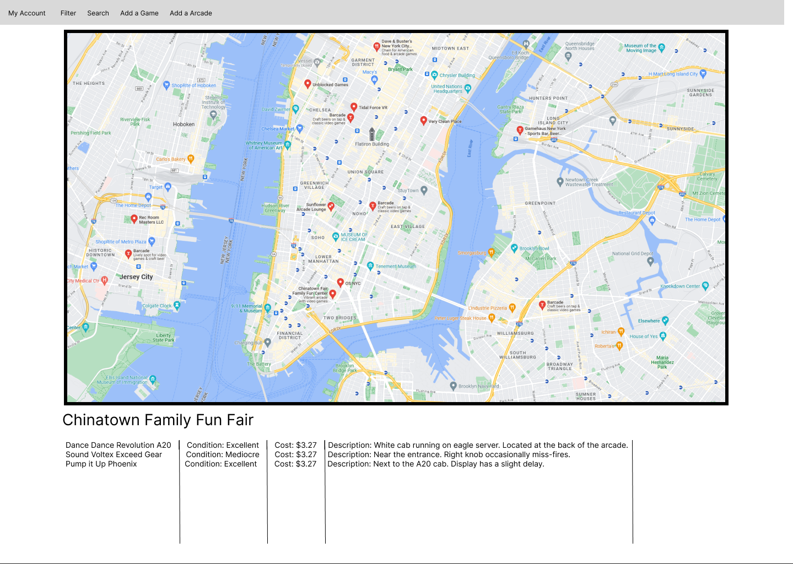

# Arcade Rhythm games Map

## Overview

A map of known locations of specific arcade rhythm games contributed by users.
Users can either add specific games and their costs/conditions to an existing location or 
they can add a new location to the map.
This site is based on bemanicn.com, a website that shows locations of arcades with rhythm games in China.

## Data Model

This application will store Users, games, and locations

* Users will store locations and games they have added
* Locations will store games

An Example User:

```javascript
{
  username: "username",
  hash: // a password hash,
  games: //an array containing the games the user uploaded
  locations: // an array containing the locations the user uploaded
}
```

An Example Location:

```javascript
{
  name: "name",
  description: "description",
  image: "path to image",
  games: // an array containing games at this location
}
```

An Example Game:

```javascript
{
  name: "name",
  condition: //either "Broken", "Poor", "Mediocre", "Good", "Excellent", and "Perfect",
  cost: number //the cost is based on per play
  description: "description"
  image: "path to image"
}
```


## [Link to Commented First Draft Schema](db.mjs) 

(__TODO__: create a first draft of your Schemas in db.mjs and link to it)

## Wireframes

(__TODO__: wireframes for all of the pages on your site; they can be as simple as photos of drawings or you can use a tool like Balsamiq, Omnigraffle, etc.)

/login - player login page


/home - page that has a map with marked points representing a location

/home/filter - page that shows all the filtering options

/home/add-location - page that allows a user to add a location

/home/add-game - page that allows a user to add a game

/home/account - page that display's the games and locations a the user has added

## Site map

(__TODO__: draw out a site map that shows how pages are related to each other)

Here's a [complex example from wikipedia](https://upload.wikimedia.org/wikipedia/commons/2/20/Sitemap_google.jpg), but you can create one without the screenshots, drop shadows, etc. ... just names of pages and where they flow to.

## User Stories or Use Cases

(__TODO__: write out how your application will be used through [user stories](http://en.wikipedia.org/wiki/User_story#Format) and / or [use cases](https://en.wikipedia.org/wiki/Use_case))

1. as non-registered user, I can register a new account with the site
2. as a user, I can log in to the site
3. as a user, I can view the map and its locations and games
4. as a user, I can filter locations by their games
5. as a user, I can add a game to a location
6. as a user, I can add a location to the map
7. as a user, I can modify my added locations and games


## Research Topics

(__TODO__: the research topics that you're planning on working on along with their point values... and the total points of research topics listed)

* (5 points) Integrate user authentication
    * I'm going to be using passport for user authentication
    * And account has been made for testing; I'll email you the password
    * see <code>cs.nyu.edu/~jversoza/ait-final/register</code> for register page
    * see <code>cs.nyu.edu/~jversoza/ait-final/login</code> for login page
* (4 points) Perform client side form validation using a JavaScript library
    * see <code>cs.nyu.edu/~jversoza/ait-final/my-form</code>
    * if you put in a number that's greater than 5, an error message will appear in the dom
* (5 points) vue.js
    * used vue.js as the frontend framework; it's a challenging library to learn, so I've assigned it 5 points
* (1 point) Google Maps api
    * used the google maps api to function as the actual map containing the locations

10 points total out of 8 required points (___TODO__: addtional points will __not__ count for extra credit)


## [Link to Initial Main Project File](app.mjs) 

(__TODO__: create a skeleton Express application with a package.json, app.mjs, views folder, etc. ... and link to your initial app.mjs)

## Annotations / References Used

(__TODO__: list any tutorials/references/etc. that you've based your code off of)

1. [passport.js authentication docs](http://passportjs.org/docs) - (add link to source code that was based on this)
2. [tutorial on vue.js](https://vuejs.org/v2/guide/) - (add link to source code that was based on this)

