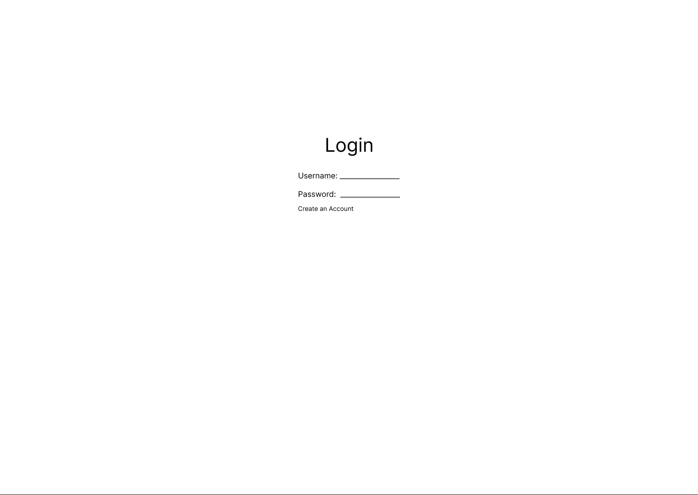
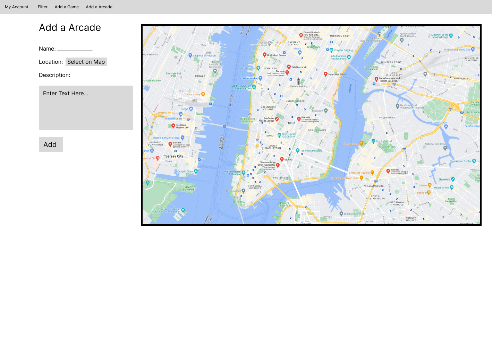
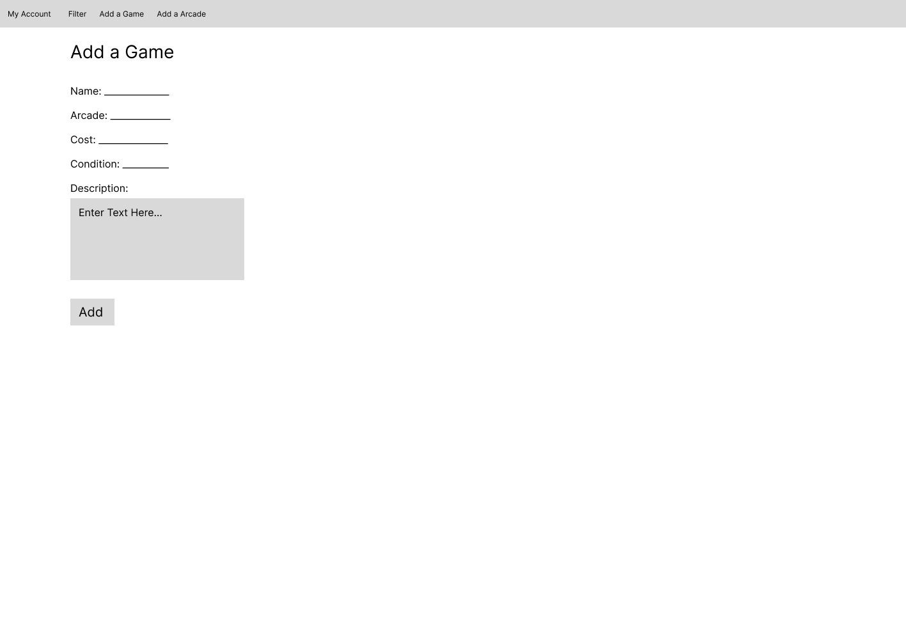
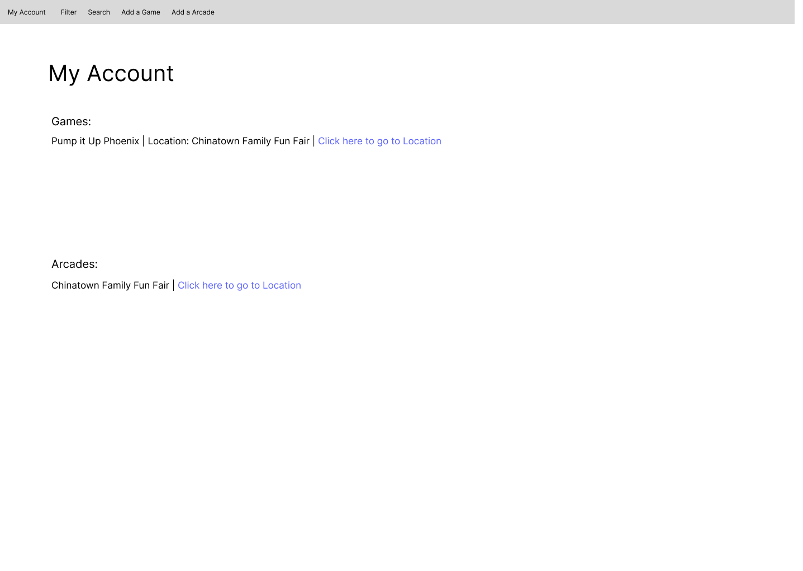
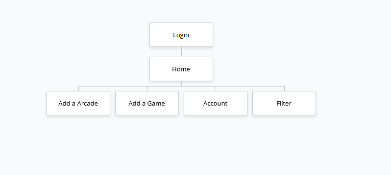

# Arcade Rhythm games Map

## Overview

A map of known locations of specific arcade rhythm games contributed by users.
Users can either add specific games and their costs/conditions to an existing location or 
they can add a new location to the map.
This site is based on bemanicn.com, a website that shows locations of arcades with rhythm games in China.

Milestone 2 Update:
* Started research on Next.js by building webapp in next.js
* Started research on google maps api by adding a working map to my site
* Implemented a form for adding location objects to a MongoDB database

Milestone 3 Update:
* 3 Forms are working, User Registration, Location, and Game
* Continued research on Next.js by continuing development of web
* Continued research on Google maps API for adding custom pointers on map
* Begun implementation on a login system and research on password security

TODO
* Implement Pointers on map that contain information about the location when clicked.
* Implement some way to display a location's game (considering doing a dropdown on the locations page)
* Add password hashing and salting

## Data Model

This application will store Users, games, and locations

* Users will store locations and games they have added
* Locations will store games

An Example User:

```javascript
const userSchema = new Schema({
    Username: {type: String, required: true},
    Password: { type: String, required: true }, //TODO Make password secure
    Email: {type: String, required: true},
    Admin: {type: String, required: true}
  });
```

An Example Location:

```javascript
const locationSchema = new Schema({
    Name: {type: String, required: true},
    Description: {type: String, required: false},
    Image: {type: String, required: false},
    Games: [{ type: Schema.Types.ObjectId, ref: 'Games', required: false }],
    XCoord: {type: Number, required: false},
    YCoord: {type: Number, required: false}
});
```

An Example Game:

```javascript
const gameSchema = new Schema({
    Name: {type: String, required: true},
    Condition: {type: String, required: false},
    Cost: {type: Number, required: false},
    Description: {type: String, required: false},
    Image: {type: String, required: false}
});
```


## [Location Schema](app/models/locations.js) 
## [Game Schema](app/models/games.js) 
## [User Schema](app/models/users.js) 

## Wireframes

/login - player login page


/home - page that has a map with marked points representing a location


/home/filter - page that shows all the filtering options


/home/add-location - page that allows a user to add a location


/home/add-game - page that allows a user to add a game


/home/account - page that display's the games and locations a the user has added


## Site map



## User Stories or Use Cases

1. as non-registered user, I can register a new account with the site
2. as a user, I can log in to the site
3. as a user, I can view the map and its locations and games
4. as a user, I can filter locations by their games
5. as a user, I can add a game to a location
6. as a user, I can add a location to the map
7. as a user, I can modify my added locations and games


## Research Topics
* (5 points) Automated functional testing for all of your routes
    * Selenium and Headless Chrome allows for the simulation of user input for testing web apps.
    * This seems useful to research as testing my routes manually for the previous assignments were very tedious.
    * I want to look into selenium as I use firefox as my main browser and it seems like a complete package for automating browser tasks.
* (3 points) Configuration Mangagement and dotenv
    * dotenv allows me to store configuration in a .env file without it being in the source code.
    * This improves security especially since I will need to store my mongoDB login credientials somewhere.
    * Since I am also using an external API, I want to research on what other applications can be applied potentially like with api keys.
* (6 points) Frontend with next.js
    * I will be using next.js as the frontend framework for my website
    * Originally I wanted to use react but I realized I would have to deploy 2 seperate apps
    * With next.js, I can use all the functionalities of react while making everything in 1 app.
* (2 point) Google Maps api
    * I will use the google maps JS api to function as the actual map containing the locations
    * The google maps api allows me to display a rendition of google maps on my website.
    * It also allows me to add pointers/markers which will be essential in showing the location of each arcade interactively
    * I am increasing this to 2 points since I find that research on building custom pointers and implementing user-added pointers is harder than expected.


## Annotations / References Used
1. [Documentation on Selenium](https://www.selenium.dev/documentation/)
2. [Documentation on Google Maps API](https://developers.google.com/maps/documentation/javascript)
3. [Dotenv homepage and information](https://www.npmjs.com/package/dotenv)
4. [React references](https://react.dev/reference/react)