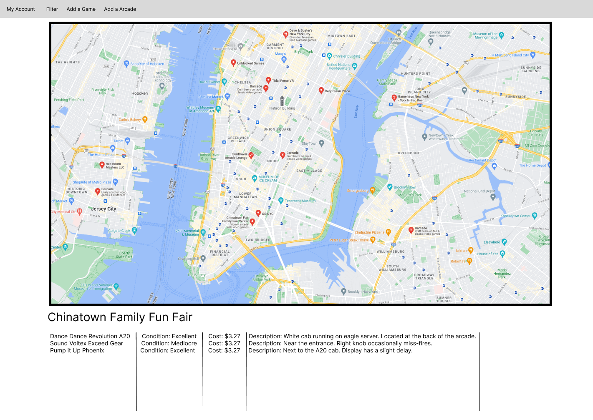
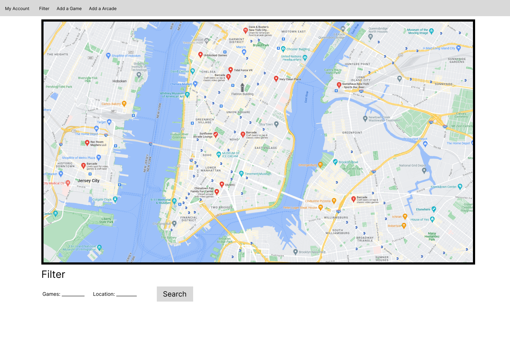
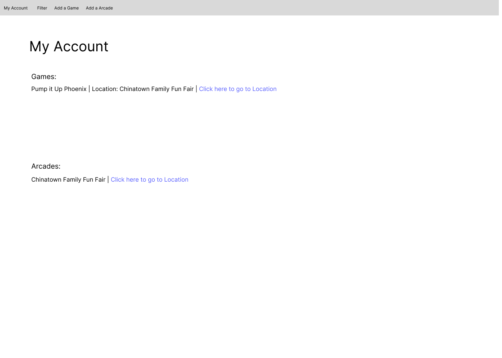

# Arcade Rhythm games Map

## Overview

A map of known locations of specific arcade rhythm games contributed by users.
Users can either add specific games and their costs/conditions to an existing location or 
they can add a new location to the map.
This site is based on bemanicn.com, a website that shows locations of arcades with rhythm games in China.

## Data Model

This application will store Users, games, and locations

* Users will store locations and games they have added
* Locations will store games

An Example User:

```javascript
{
  username: "username",
  hash: // a password hash,
  games: //an array containing the games the user uploaded
  locations: // an array containing the locations the user uploaded
}
```

An Example Location:

```javascript
{
  name: "name",
  description: "description",
  image: "path to image",
  games: // an array containing games at this location
}
```

An Example Game:

```javascript
{
  name: "name",
  condition: //either "Broken", "Poor", "Mediocre", "Good", "Excellent", and "Perfect",
  cost: number //the cost is based on per play
  description: "description"
  image: "path to image"
}
```


## [Location Schema](app/locations.js) 
## [Game Schema](app/games.js) 
## [User Schema](app/users.js) 

## Wireframes

/login - player login page


/home - page that has a map with marked points representing a location


/home/filter - page that shows all the filtering options


/home/add-location - page that allows a user to add a location


/home/add-game - page that allows a user to add a game


/home/account - page that display's the games and locations a the user has added


## Site map


## User Stories or Use Cases

1. as non-registered user, I can register a new account with the site
2. as a user, I can log in to the site
3. as a user, I can view the map and its locations and games
4. as a user, I can filter locations by their games
5. as a user, I can add a game to a location
6. as a user, I can add a location to the map
7. as a user, I can modify my added locations and games


## Research Topics
* (5 points) Automated functional testing for all of your routes
    * Selenium and Headless Chrome allows for the simulation of user input for testing web apps.
    * This seems useful to research as testing my routes manually for the previous assignments were very tedious.
    * I want to look into selenium as I use firefox as my main browser and it seems like a complete package for automating browser tasks.
* (3 points) Configuration Mangagement and dotenv
    * dotenv allows me to store configuration in a .env file without it being in the source code.
    * This improves security especially since I will need to store my mongoDB login credientials somewhere.
    * Since I am also using an external API, I want to research on what other applications can be applied potentially like with api keys.
* (6 points) Frontend with react.js
    * I will be using react.js as the frontend framework for my website
    * React is a open source JS library used for building single page applications with more dynamic data that needs to be updated frequently.
    * React provides a modular component based architecture allowing for modular design for my website which has several different pages that rely on each other.
    * This is useful for my site as it will require constant updates for the locations and games as well as their positions on the map.
    * I would also like to learn more of how react.js works differently compared to handlebars
* (1 point) Google Maps api
    * I will use the google maps JS api to function as the actual map containing the locations
    * The google maps api allows me to display a rendition of google maps on my website.
    * It also allows me to add pointers/markers which will be essential in showing the location of each arcade interactively


## Annotations / References Used
1. [Documentation on Selenium](https://www.selenium.dev/documentation/)
2. [Documentation on Google Maps API](https://developers.google.com/maps/documentation/javascript)
3. [Dotenv homepage and information](https://www.npmjs.com/package/dotenv)
4. [React references](https://react.dev/reference/react)

